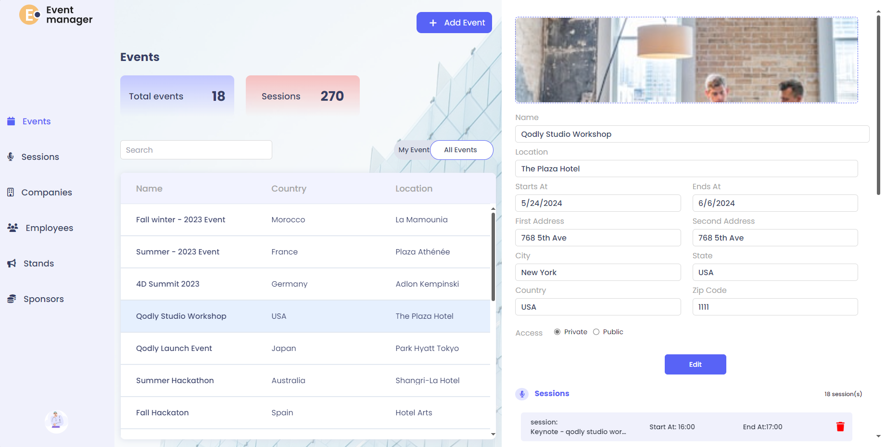
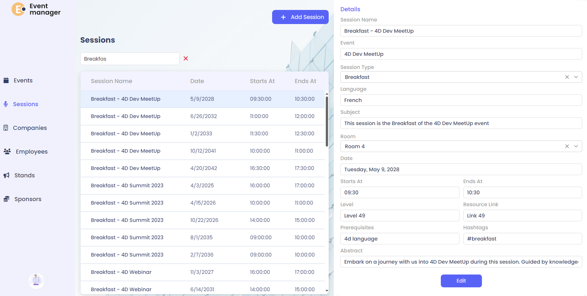
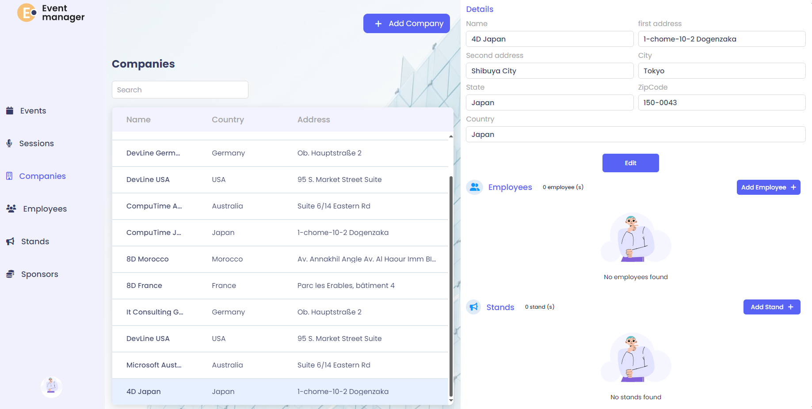
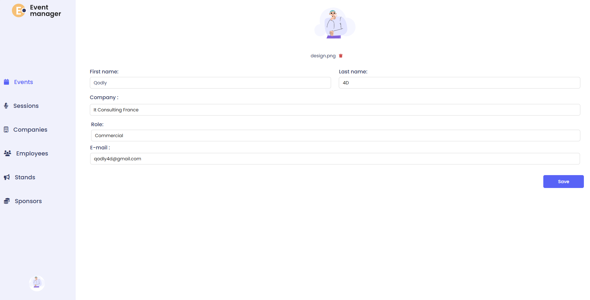

# Event Manager Application

This demo app is built with 4D Qodly Pro and is meant to inspire you or help you kickstart your own project.

## 🎯 Purpose of the Application

This application serves as a complete event management platform allowing users to plan, organize, and manage events. It includes features for handling events, sessions, speakers, sponsors, stands, technicians, equipment, and participant inscriptions with role-based access.

## 🏠 Main Features

- Interactive Datatable to browse events and sessions
- Dedicated event and session detail pages
- CRUD workflows for creating, editing, and managing events, sessions, speakers, sponsors, etc.

- Ability to manage companies, employees, equipment, stands, and technicians
- Participant inscription and management

- Role-based access management for different user types
- Profile management for users

- Public access for viewing events and registering
- Secure authentication and session management

## 🚀 How to run

### Pre-requisites (4D Software):
- Download the latest Release version of 4D: [Product Download](https://us.4d.com/product-download/Feature-Release)
- Or the latest Beta version: [Beta Program](https://discuss.4d.com/)
- Follow activation steps: [Installation Guide](https://developer.4d.com/docs/GettingStarted/installation)

### Steps to Run the Project
- Clone or download this repository to your local machine. Need help? See Using GitHub with 4D.
- Open the project in 4D: Go to File > Open Project (More details here: Open a Project)
- Open Qodly Studio: Go to Design > Qodly Studio menu
- Run the application: Click Run to start the server and preview the app in your browser

## Test accounts and sample data

- The app includes a data generator `Project/Sources/Methods/generateData.4dm` which creates sample events, users, companies, etc. You can call it from the UI or run `ds.generateData()` in the server console.
- To test the login, you can use the following credentials:
    - Email: john.smith@example.com
    - Password: a1b2c3
    
## Where to find the code for each feature

If you want to change the behavior or appearance of a specific feature, edit the files listed below.

- Authentication / Login
  - UI: Relevant WebForms (check for login forms).
  - Server: `Project/Sources/Classes/DataStore.4dm` (method: `authentify`) — handles login, session privileges and landing page routing.

- Events Management
  - UI: `Project/Sources/WebForms/` (events-related forms).
  - Server: `Project/Sources/Classes/Event.4dm`, `EventEntity.4dm`, `EventSelection.4dm`.

- Sessions Management
  - UI: `Project/Sources/WebForms/` (sessions-related forms).
  - Server: `Project/Sources/Classes/Session.4dm`, `SessionEntity.4dm`, `SessionSelection.4dm`.

- Companies and Employees
  - Server: `Project/Sources/Classes/Company.4dm`, `Employee.4dm`, etc.

- Sponsors, Stands, Technicians, Equipment
  - Server: Corresponding class files in `Project/Sources/Classes/`.

